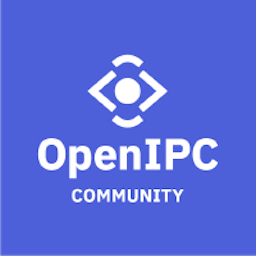

# OpenIPC Configurator



A multi-platform configuration tool for OpenIPC cameras, built using Avalonia UI. The application provides a user-friendly interface for managing camera settings, viewing telemetry data, and setting up the camera.

Based off of MarioFPV's [OpenIPC Config](https://github.com/OpenIPC/configurator)

[Demo on YouTube](https://www.youtube.com/watch?v=iJXXMcnOC7w)

* Android and IOS versions coming soon!

## Features

* **Camera settings management**: configure camera settings such as resolution, frame rate, and exposure
* **Telemetry**: view real-time telemetry data from the camera, including metrics such as temperature, voltage, and signal strength
* **Setup wizards**: guided setup processes for configuring the camera and connecting to the network
* **Multi-platform support**: run the application on Windows, macOS, and Linux platforms
* **YAML-based configuration files**: easily edit and customize camera settings using YAML configuration files

## Technical Details

* **Built using Avalonia UI**, a cross-platform XAML-based UI framework
* `.NET Core 3.1 or later`
* **Supports multiple camera models and configurations**
* **Includes logging and error handling** for troubleshooting and debugging

## Files and Folders

* `Views`: contains Avalonia UI views for the application, including camera settings, telemetry, and setup wizards
* `ViewModels`: contains view models for the application, responsible for managing data and business logic
* `Models`: contains data models for the application, representing camera settings and telemetry data
* `Services`: contains application-wide services and utilities, such as logging and SSH clients
* `Styles`: contains styles and resources for the application, including themes and fonts
* `README.md`: this file, containing information about the project and its features

## Logging

https://github.com/serilog/serilog/wiki/Configuration-Basics

## App Logs
* Android: /data/user/0/org.openipc.OpenIPC/files/.config/openipc-configurator.log
* Mac: "$HOME/Library/Application Support/OpenIPC_Config/Logs"
* Windows: %APPDATA%\Local\OpenIPC_Config\Logs
* Linux: ~/.config/openipc-configurator.log


Based on your folder structure, here’s an explanation of each project and what it likely targets:

### Project Breakdown

1. **OpenIPC**
    - The core or shared library project that other platform-specific projects reference.
    - It likely contains shared code, models, services, or ViewModels that can be used across all platforms (Desktop, Android, Browser, iOS).

2. **OpenIPC.Desktop**
    - This project is intended for **desktop platforms** (Windows, macOS, and Linux).
    - In Avalonia, a "Desktop" project can target multiple operating systems using `net7.0-windows`, `net7.0-macos`, and `net7.0-linux`.
    - You can configure it to build for any or all of these desktop operating systems.

3. **OpenIPC.Android**
    - This project targets **Android** devices.
    - It will have Android-specific configurations and might use `net8.0-android` or `net7.0-android` as the `TargetFramework`.
    - Contains Android-specific files and setup, like Android permissions, manifest configurations, etc.

4. **OpenIPC.Browser**
    - This project is meant for **web applications**, targeting **WebAssembly (WASM)** using Avalonia's browser support.
    - The target framework is typically `net8.0-browser`.
    - This allows you to run the app in a web browser, making use of WebAssembly technology to execute .NET code in a web environment.

5. **OpenIPC.iOS**
    - This project is intended for **iOS devices** (iPhones and iPads).
    - Uses a target framework like `net8.0-ios` or `net7.0-ios` with iOS-specific configurations.
    - Contains iOS-specific files such as `Info.plist` for app metadata, `Entitlements.plist` for permissions, and `AppDelegate.cs` for application lifecycle management.

### Summary of Target Platforms for Each Project

| Project            | Target Platform(s)     | Description                                                                                      |
|--------------------|------------------------|--------------------------------------------------------------------------------------------------|
| **OpenIPC**        | Shared (all platforms) | Core library or shared code used across all platform-specific projects.                          |
| **OpenIPC.Desktop**| Windows, macOS, Linux  | Targets desktop OSs, can be configured to support `win-x64`, `osx-arm64`, `linux-x64`, etc.     |
| **OpenIPC.Android**| Android                | Targets Android devices with `net8.0-android` or `net7.0-android`.                               |
| **OpenIPC.Browser**| Browser (WebAssembly)  | Targets web browsers with WebAssembly using `net8.0-browser`.                                    |
| **OpenIPC.iOS**    | iOS                    | Targets iOS devices with `net8.0-ios` or `net7.0-ios`.                                          |

### Building Each Project

To build each project, navigate to the specific project folder and run the `dotnet publish` command with the appropriate runtime identifier for that platform.

For example:
- **macOS Desktop**: Go to `OpenIPC.Desktop` and run:

  ```bash
  dotnet publish -c Release -r osx-arm64 --self-contained


### Using Semantic Versioning

When creating tags, follow semantic versioning:

* v1.0.0: Initial release.
* v1.0.1: Patch release (bug fixes).
* v1.1.0: Minor release (new features, backwards compatible).
* v2.0.0: Major release (breaking changes).


## Code Coverage

```
dotnet test --collect:"XPlat Code Coverage"  
reportgenerator -reports:"TestResults/**/*.xml" -targetdir:coverage-report -reporttypes:Html
```


IOS:
https://docs.avaloniaui.net/docs/guides/platforms/ios/build-and-run-your-application-on-your-iphone-or-ipad